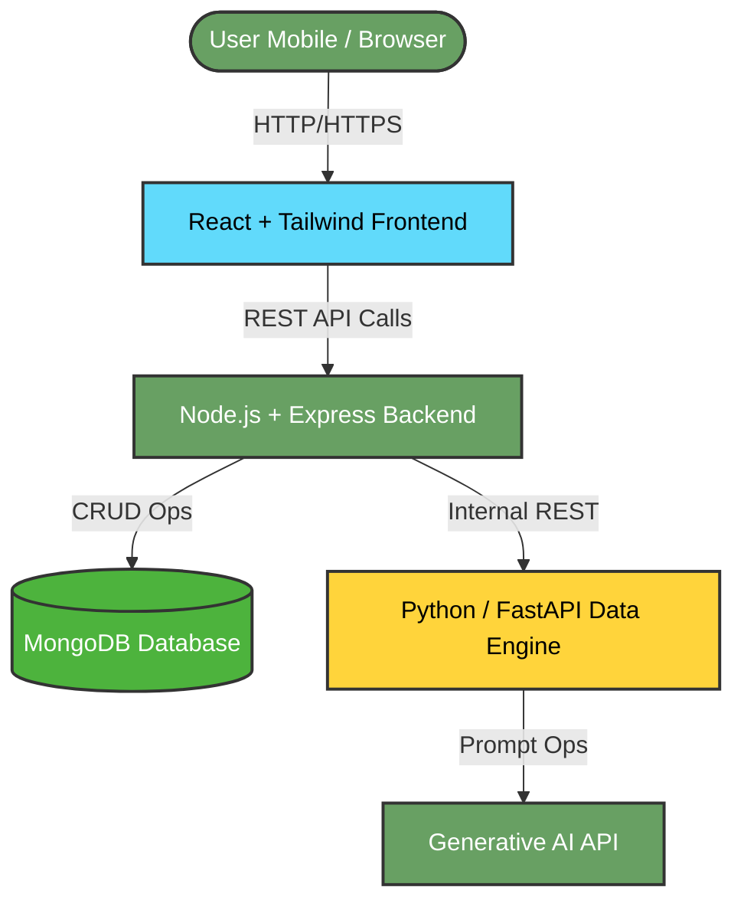
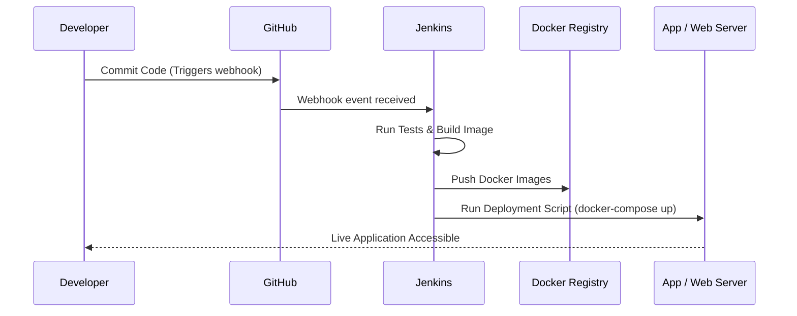
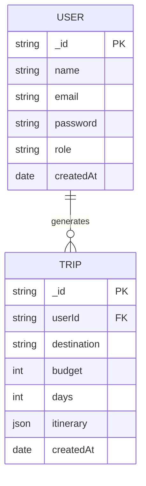

# Architecture Diagrams & Database Schemas

## 1. System Architecture

```mermaid
graph TD
    User([User Mobile / Browser]) -->|HTTP/HTTPS| Frontend[React + Tailwind Frontend]
    Frontend -->|REST API Calls| Backend[Node.js + Express Backend]
    Backend -->|CRUD Ops| MongoDB[(MongoDB Database)]
    Backend -->|Internal REST| PythonEngine[Python / FastAPI Data Engine]
    PythonEngine -->|Prompt Ops| ExternalAPI[Generative AI API]

    classDef react fill:#61dafb,stroke:#333,stroke-width:2px,color:#000;
    classDef node fill:#68a063,stroke:#333,stroke-width:2px,color:#fff;
    classDef mongo fill:#4DB33D,stroke:#333,stroke-width:2px,color:#fff;
    classDef python fill:#FFD43B,stroke:#333,stroke-width:2px,color:#000;

    class Frontend react;
    class Backend node;
    class MongoDB mongo;
    class PythonEngine python;
```

## 2. CI/CD Pipeline Flow

```mermaid
sequenceDiagram
    participant Dev as Developer
    participant Git as GitHub
    participant Jenkins as Jenkins
    participant Docker as Docker Registry
    participant Server as App / Web Server

    Dev->>Git: Commit Code (Triggers webhook)
    Git->>Jenkins: Webhook event received
    Jenkins->>Jenkins: Run Tests & Build Image
    Jenkins->>Docker: Push Docker Images
    Jenkins->>Server: Run Deployment Script (docker-compose up)
    Server-->>Dev: Live Application Accessible
```

## 3. Database Entity Relationship

```mermaid
erDiagram
    USER {
        string _id PK
        string name
        string email
        string password
        string role
        date createdAt
    }

    TRIP {
        string _id PK
        string userId FK
        string destination
        int budget
        int days
        json itinerary
        date createdAt
    }

    USER ||--o{ TRIP : generates
```
